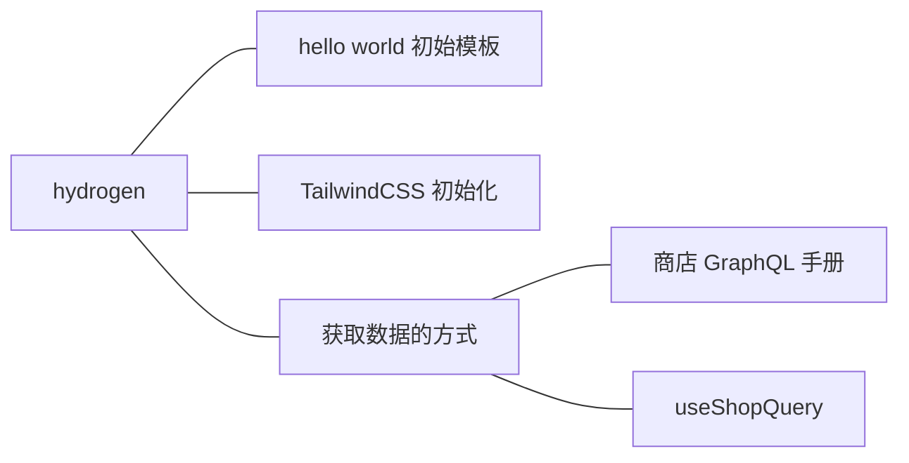

# Shopify Hydrogen

[Hydrogen Dev](https://shopify.dev/custom-storefronts/hydrogen/getting-started/tutorial)



## 初始化项目结构

```bash
.
├── README.md
├── hydrogen.config.js
├── index.html
├── jsconfig.json
├── package.json
├── public
├── src
│   ├── App.server.jsx
│   ├── assets
│   │   └── favicon.svg
│   ├── index.css
│   └── routes
│   └── index.server.jsx
├── vite.config.js
└── yarn.lock
```

## 安装 tailwind css

[tailwind css 速查 - 中文](https://www.tailwindcss.cn/)
[tailwind css 官网 - 英文](https://tailwindcss.com/)

```bash
yarn add tailwindcss @tailwindcss/typography postcss autoprefixer
yarn tailwindcss init -p
```

```js
// tailwind.config.js
module.exports = {
  content: ['./index.html', './src/**/*.{js,jsx,ts,tsx}'],
  theme: {
    extend: {},
  },
  plugins: [require('@tailwindcss/typography')],
}
```

```css
/*  /src/index.css  */

@tailwind base;
@tailwind components;
@tailwind utilities;
```

## 获取 shopify 商店的数据

### 查 GraphiQL 手册

[商城api文档](https://shopify.dev/api/storefront)
开发环境下, GraphQL在线调试: 
- http://localhost:3000/graphql
- http://localhost:3000/___graphql

示例是请求的`demo商店数据`, 一般开发是需要[连接自己开发的商城](https://shopify.dev/custom-storefronts/hydrogen/configuration)。

可以在本地环境调试如下请求代码:
```grapql
query ShopInfo {
  shop {
    name
    description
  }
}
```

### 在 Hydrogen app 里面使用查询数据

Hydrogen 提供了 [useShopQuery](https://shopify.dev/api/hydrogen/hooks/global/useshopquery) 这个hook在 server components 里面获取数据。

组件类型：
- server `xxx.server.jsx`: 组件获取数据和渲染内容都在服务端进行, [服务端组件](https://shopify.dev/custom-storefronts/hydrogen/react-server-components#benefits)的依赖不在客户端的依赖包里面。服务端组件不包含任何客户端渲染的交互。有且只有 服务端组件 才能使用 [Storefront API](https://shopify.dev/custom-storefronts/hydrogen/react-server-components#component-types:~:text=calls%20to%20the-,Storefront%20API,-.).

- client `xxx.client.jsx`: 组件在客户端渲染, 客户端组件包含客户端侧的状态交互性。

- 共享组件 `xxx.jsx`： 在服务端和客户端都能渲染的组件。

### 第一个服务端组件

[第一个服务端组件 `Layout.server.jsx`](https://shopify.dev/custom-storefronts/hydrogen/getting-started/tutorial/fetch-data#create-a-layout-component)是一个布局组件, 因为布局组件不需要任何客户端侧的交互。一个服务端组件，定义了一个页面的结构和组织，可用于 Hydrogen 应用程序的不同部分。

### 生成 SEO 标签

Hydrogen 提供了一个可以渲染 SEO 信息的 [`<SEO/>`客户端组件](https://shopify.dev/api/hydrogen/components/primitive/seo)，`<SEO/>`使用从`Storefront API`获取的商城数据来生成可以被浏览器搜索引擎识别的 `head` 标签。

